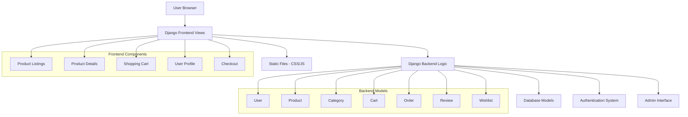

# Electronics E-commerce Site Architecture

## Project Overview
A modern electronics and gadgets e-commerce platform built with Django backend and responsive HTML/CSS/JavaScript frontend featuring a blue/white theme.

## Technology Stack
- **Backend**: Django 4.x (Python)
- **Frontend**: HTML5, CSS3, JavaScript (ES6+)
- **Database**: SQLite (development), PostgreSQL (production ready)
- **Styling**: Custom CSS with modern blue/white theme
- **Authentication**: Django's built-in authentication system

## System Architecture



## Database Schema

### Core Models

#### User (Extended Django User)
- id (Primary Key)
- username
- email
- first_name
- last_name
- phone_number
- address
- date_joined
- is_active

#### Category
- id (Primary Key)
- name
- description
- slug
- created_at

#### Product
- id (Primary Key)
- name
- description
- price
- category (Foreign Key to Category)
- image
- stock_quantity
- is_active
- created_at
- updated_at
- slug

#### Cart
- id (Primary Key)
- user (Foreign Key to User)
- created_at

#### CartItem
- id (Primary Key)
- cart (Foreign Key to Cart)
- product (Foreign Key to Product)
- quantity
- added_at

#### Order
- id (Primary Key)
- user (Foreign Key to User)
- total_amount
- status (pending, processing, shipped, delivered, cancelled)
- shipping_address
- created_at
- updated_at

#### OrderItem
- id (Primary Key)
- order (Foreign Key to Order)
- product (Foreign Key to Product)
- quantity
- price

#### Review
- id (Primary Key)
- product (Foreign Key to Product)
- user (Foreign Key to User)
- rating (1-5)
- comment
- created_at

#### Wishlist
- id (Primary Key)
- user (Foreign Key to User)
- product (Foreign Key to Product)
- added_at

## Project Structure

```
ecommerce_site/
├── manage.py
├── requirements.txt
├── README.md
├── ecommerce_site/
│   ├── __init__.py
│   ├── settings.py
│   ├── urls.py
│   └── wsgi.py
├── store/
│   ├── __init__.py
│   ├── admin.py
│   ├── apps.py
│   ├── models.py
│   ├── views.py
│   ├── urls.py
│   ├── forms.py
│   └── migrations/
├── templates/
│   ├── base.html
│   ├── store/
│   │   ├── index.html
│   │   ├── product_list.html
│   │   ├── product_detail.html
│   │   ├── cart.html
│   │   ├── checkout.html
│   │   └── profile.html
│   └── registration/
│       ├── login.html
│       ├── register.html
│       └── profile.html
├── static/
│   ├── css/
│   │   ├── style.css
│   │   └── responsive.css
│   ├── js/
│   │   ├── main.js
│   │   ├── cart.js
│   │   └── wishlist.js
│   └── images/
└── media/
    └── products/
```

## Key Features Implementation

### 1. User Authentication
- Registration with email verification
- Login/Logout functionality
- User profile management
- Password reset capability

### 2. Product Management
- Category-based product organization
- Product search and filtering
- Product image handling
- Stock management

### 3. Shopping Cart
- Session-based cart for anonymous users
- Database-stored cart for authenticated users
- Add/remove/update quantities
- Cart persistence across sessions

### 4. Order Processing
- Checkout form with shipping details
- Order confirmation
- Order history for users
- Basic payment simulation

### 5. Reviews & Wishlist
- Product rating system (1-5 stars)
- User reviews with comments
- Personal wishlist functionality
- Review moderation through admin

## Design Theme
- **Primary Colors**: Blue (#007bff, #0056b3)
- **Secondary Colors**: White (#ffffff), Light Gray (#f8f9fa)
- **Accent Colors**: Dark Blue (#003d82), Success Green (#28a745)
- **Typography**: Modern sans-serif fonts
- **Layout**: Clean, minimalist design with card-based components

## Security Considerations
- CSRF protection enabled
- SQL injection prevention through Django ORM
- XSS protection with template escaping
- Secure password hashing
- Input validation and sanitization

## Performance Optimizations
- Database query optimization
- Static file compression
- Image optimization
- Lazy loading for product images
- Pagination for product listings

## API Endpoints (Django Views)

### Public Endpoints
- `/` - Home page with featured products
- `/products/` - Product listing with filtering
- `/products/<slug>/` - Product detail page
- `/search/` - Product search results

### User Endpoints
- `/accounts/register/` - User registration
- `/accounts/login/` - User login
- `/accounts/logout/` - User logout
- `/profile/` - User profile management

### Cart & Orders
- `/cart/` - Shopping cart view
- `/cart/add/<product_id>/` - Add to cart
- `/cart/remove/<item_id>/` - Remove from cart
- `/checkout/` - Checkout process
- `/orders/` - Order history

### Wishlist & Reviews
- `/wishlist/` - User wishlist
- `/wishlist/add/<product_id>/` - Add to wishlist
- `/reviews/add/<product_id>/` - Add product review

This architecture provides a solid foundation for a scalable, maintainable e-commerce platform with all the requested features.